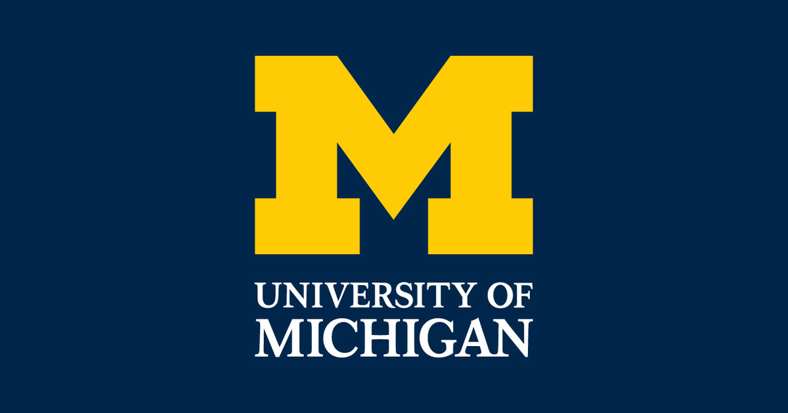

# 📊 Applied Data Science with Python – University of Michigan

  

#### Instructor(s) : V. G. Vinod Vydiswaran, Assistant Professor

This repository documents my journey through the **Applied Data Science with Python Specialization** offered by the University of Michigan on Coursera. The specialization focuses on practical data science skills using Python, covering data manipulation, visualization, machine learning, and text mining.

---

## 🎯 Specialization Overview

This specialization provides a hands-on introduction to data science using Python. It emphasizes real-world datasets, practical techniques, and applied problem-solving.

### Skills Gained

* Data manipulation and cleaning
* Data visualization and storytelling
* Statistical analysis
* Machine learning fundamentals
* Text mining and NLP
* Social network analysis

---

## 📚 Course Breakdown

### 1. Introduction to Data Science in Python

**Description:**
Covers the basics of Python for data science, including data structures, data manipulation, and introductory analysis.

**Key Topics:**

* Python fundamentals (lists, dictionaries, functions)
* NumPy basics
* Pandas for data manipulation
* Data cleaning and preprocessing
* Handling missing data
* Basic data analysis

**Tools:**

* Python
* NumPy
* Pandas

---

### 2. Applied Plotting, Charting & Data Representation in Python

**Description:**
Focuses on visualizing data effectively using Python libraries.

**Key Topics:**

* Principles of data visualization
* Matplotlib basics and advanced usage
* Chart types (line, bar, scatter, histograms)
* Data storytelling
* Visual encoding and perception

**Tools:**

* Matplotlib
* Pandas plotting

---

### 3. Applied Machine Learning in Python

**Description:**
Introduces machine learning concepts and implementation using Scikit-learn.

**Key Topics:**

* Supervised learning (classification & regression)
* Model evaluation and validation
* Overfitting and underfitting
* Feature engineering
* Model selection

**Algorithms Covered:**

* k-Nearest Neighbors
* Decision Trees
* Logistic Regression
* Support Vector Machines

**Tools:**

* Scikit-learn
* NumPy
* Pandas

---

### 4. Applied Text Mining in Python

**Description:**
Explores natural language processing and working with textual data.

**Key Topics:**

* Text preprocessing (tokenization, normalization)
* Regular expressions
* Bag-of-words and TF-IDF
* Sentiment analysis
* Topic modeling basics

**Tools:**

* NLTK
* Scikit-learn

---

### 5. Applied Social Network Analysis in Python

**Description:**
Introduces graph theory and analysis of social networks.

**Key Topics:**

* Network structure and metrics
* Centrality measures
* Community detection
* Graph visualization
* Real-world network datasets

**Tools:**

* NetworkX
* Matplotlib

---

## 🛠️ Technologies Used

* Python 3.x
* Jupyter Notebook
* NumPy
* Pandas
* Matplotlib
* Scikit-learn
* NLTK
* NetworkX

---

## 🧠 Learning Outcomes

By completing this specialization, you will be able to:

* Analyze and manipulate complex datasets
* Create meaningful visualizations
* Build and evaluate machine learning models
* Process and analyze text data
* Understand and analyze network structures

---

## 📌 Notes

* All assignments are based on real-world datasets.
* Emphasis is on **practical application rather than theory**.
* Ideal for learners with basic Python knowledge.

---

## 📜 License

This repository is for educational purposes only. Course content belongs to the University of Michigan and Coursera.

---

## 🙌 Acknowledgments

* University of Michigan
* Coursera platform
* Course instructors and contributors

---

